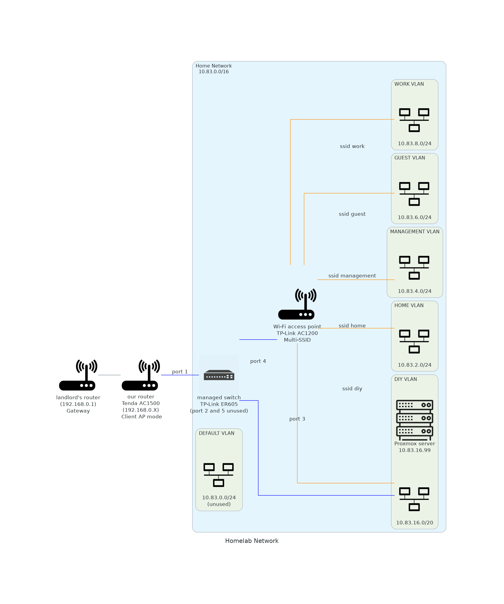

# personal-homelab

## Network diagram

## Components

### Motherboard

ASUS Prime B450M-AII

### CPU

AMD Ryzen 3 3200G (3.6GHz, 4 cores)

- base clock speed 3.6GHz (max 4)
- 4 CPU cores (4 threads, no hyperthreading!)
- 65 Watts

### RAM

crucial M.2 SSD
- 500 GB
- PCIe 4.0
- NVMe

